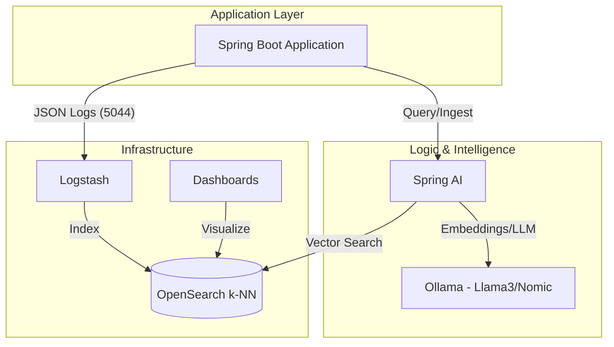

# Spring Boot OpenSearch: Logging & Local AI (RAG)

This project is a high-performance demonstration of modern microservice patterns, combining **Centralized Logging** (ELK Stack) and an **AI Knowledge Base (RAG)** using Local LLMs.

## 🏗 Architecture

The system consists of two primary pipelines:

### 1. Logging Pipeline
- **Spring Boot**: Sends structured JSON logs via TCP.
- **Logstash**: Processes and forwards logs to OpenSearch.
- **OpenSearch**: Indexes logs for real-time analysis.

### 2. Local AI Knowledge Base (RAG)
- **Spring AI + Ollama**: Uses `llama3` for chat and `nomic-embed-text` for vector embeddings.
- **OpenSearch k-NN**: Acts as a high-performance Vector Database.
- **Apache Tika**: Automatically parses PDFs, Word docs, and Markdown for ingestion.



---

## 🚀 Getting Started

### Prerequisites
- **Docker & Docker Compose**
- **Java 21** & Maven 3.x
- **Ollama**: [Download here](https://ollama.com/) and pull required models:
  ```bash
  ollama pull llama3
  ollama pull nomic-embed-text
  ```

### 1. Spin up Infrastructure
```bash
docker compose -f docker/docker-compose.yml up -d
```
Starts **OpenSearch** (9200), **Logstash** (5044), and **Dashboards** (5601).

### 2. Run the Application
```bash
cd spring-boot-app
./mvnw spring-boot:run
```

---

## 📝 Features & API

### 📊 Centralized Logging
Capture structured logs automatically across all levels.
- **Generate Log**: `GET http://localhost:8080/api/product/123`
- **Visualize**: Open [http://localhost:5601](http://localhost:5601) and create an index pattern for `spring-logs-*`.

### 🧠 AI Knowledge Base (RAG)
Turn your documents into a searchable AI brain.
- **Upload Knowledge** (PDF, DOCX, MD, TXT):
  ```bash
  curl -X POST -F "file=@your_doc.pdf" http://localhost:8080/api/knowledge/upload
  ```
- **Ask AI**:
  ```bash
  curl "http://localhost:8080/api/knowledge/ask?q=What+is+this+document+about?"
  ```

---

## 🛠 Tech Stack
- **Framework**: Spring Boot 3.5.0, Spring AI 1.0.0-M6
- **Database**: OpenSearch (with k-NN plugin)
- **AI/ML**: Ollama (Local execution)
- **Logging**: Logstash, Logback-encoder
- **Parsing**: Apache Tika

---

*This project demonstrates how to build observable and intelligent applications using 100% open-source and local tools.*
