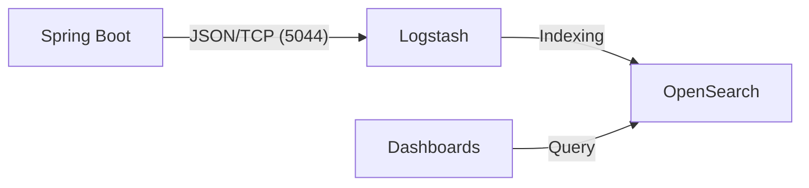

# Spring Boot OpenSearch Logging Demo

This project demonstrates a complete end-to-end logging pipeline using **Spring Boot**, **Logstash**, **OpenSearch**, and **OpenSearch Dashboards**. It shows how to capture logs in JSON format and send them over TCP to a centralized logging system for real-time analysis and visualization.

## 🏗 Architecture

The logging flow is as follows:
1.  **Spring Boot App**: Uses `logback-spring.xml` with `LogstashTcpSocketAppender` to send JSON logs via TCP.
2.  **Logstash**: Listens on port `5044`, receives JSON-encoded logs, and forwards them to OpenSearch.
3.  **OpenSearch**: Stores and indexes the logs (daily indices: `spring-logs-YYYY.MM.dd`).
4.  **OpenSearch Dashboards**: Provides a web UI to search, analyze, and visualize logs.



## 🚀 Getting Started

### Prerequisites
- Docker & Docker Compose
- Java 17+
- Maven 3.x

### 1. Spin up Infrastructure
Navigate to the `docker` directory and start the services:

```bash
cd docker
docker compose up -d
```

This will start:
- **OpenSearch** (Port `9200`)
- **Logstash** (Port `5044` for TCP logs)
- **OpenSearch Dashboards** (Port `5601`)

### 2. Run the Spring Boot Application
Navigate to the `spring-boot-app` directory and run via Maven:

```bash
cd spring-boot-app
mvn spring-boot:run
```

The application is configured to send logs to `localhost:5044` (Logstash).

### 3. Generate Logs
Use the following API endpoints to generate different log levels (INFO, WARN, ERROR):

*   **Hello**: `GET http://localhost:8080/api/hello`
*   **Product Demo**: `GET http://localhost:8080/api/product/{id}` (has random warnings and errors)
*   **Order**: `POST http://localhost:8080/api/order`

### 4. Verify in OpenSearch Dashboards
1.  Open [http://localhost:5601](http://localhost:5601).
2.  Go to **Management** > **Stack Management** > **Index Patterns**.
3.  Create an index pattern for `spring-logs-*` with `@timestamp` as the time field.
4.  Go to **Discover** to see your logs in real-time.

### 📊 Dashboard Visualizations
The project includes a guide to build a comprehensive dashboard with:
*   **Log Count Over Time** (Area Chart): Monitor request volume.
*   **Log Level Distribution** (Pie Chart): Breakdown of INFO vs WARN vs ERROR.
*   **Top 10 Loggers** (Data Table): Identify which services generate the most noise.
*   **Total Error Count** (Metric): Real-time counter of critical failures.

---

## 🛠 Project Structure

- `/docker`: Contains `docker-compose.yml` and Logstash pipeline configuration.
- `/spring-boot-app`: A standard Spring Boot 3.x application.
    - `src/main/resources/logback-spring.xml`: Configuration for Logstash appender.
    - `src/main/java/.../DemoController.java`: Sample API to test logging.
- `/done-phase`: Documented history of the project implementation phases.

## 📝 Key Configurations

### Logback JSON Formatting
The application uses the `logstash-logback-encoder` to format logs as JSON, which is essential for structured logging:

```xml
<appender name="LOGSTASH" class="net.logstash.logback.appender.LogstashTcpSocketAppender">
    <destination>localhost:5044</destination>
    <encoder class="net.logstash.logback.encoder.LoggingEventCompositeJsonEncoder">
        <providers>
            <timestamp/><logLevel/><loggerName/><threadName/><stackTrace/>
        </providers>
    </encoder>
</appender>
```

### Logstash Pipeline
Configured to receive JSON and output to OpenSearch:

```text
input {
  tcp { port => 5044 codec => json_lines }
}
output {
  opensearch {
    hosts => ["http://opensearch:9200"]
    index => "spring-logs-%{+YYYY.MM.dd}"
  }
}
```

---

*This project was built as a demonstration of modern observability patterns in microservices.*
